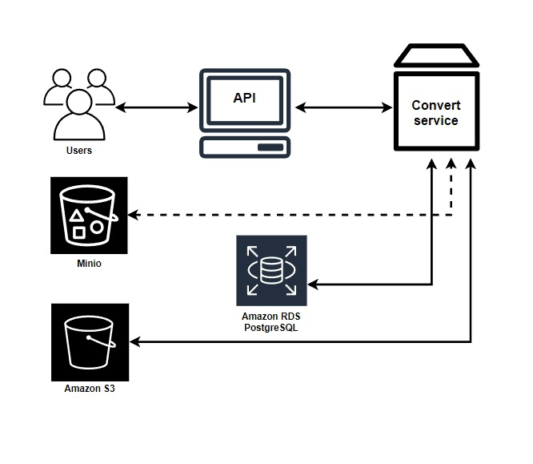
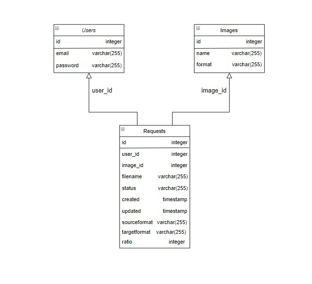

# Image-converter
Service that expose a RESTful API to convert JPEG to PNG and vice versa and compress the image with the compression ratio specified by the user. The user has the ability to view the history and status of their requests (queued, processed, completed) and download the original image and the processed one.

## Build & Run (Locally)
### Prerequisites
- go 1.16
- docker
- golangci-lint (<i>optional</i>, used to run code checks)
- aws access and secret key

Create .env file in root directory and add following values:
```dotenv
API_PORT=

DB_USERNAME=
DB_PASSWORD=
DB_NAME=
DB_HOST=
DB_PORT=
DB_SSL_MODE=

AWS_BUCKET_NAME=
AWS_ACC_ID=
AWS_SECRET=
AWS_REGION=

JWT_SIGNING_KEY=
JWT_TOKEN_TTL=
```

Use `make run` to build&run project, `make lint` to check code with linter.

## Architecture Diagram


## Entity–relationship model


# Endpoints
 * /auth/signup - user registration [POST]
 * /auth/login - user authorization [POST]
 * /image/convert - convert and compress image [POST]
 * /image/download/{id} - downloads needed image [GET]
 * /requests - get the user's requests history [GET]

## Run image converter from a binary command line interface
Grab a binary from [releases page](https://github.com/Nikby53/image-converter/releases/tag/v.0.1.0)


